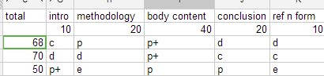
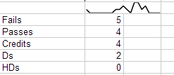

Spreadsheets are great. Well maybe not great, but a valuable multi-tool. On any given day I&#8217;m probably using at least 2 spreadsheets. In particular I&#8217;m talking about Google Spreadsheets. A single backed up place that holds my tax claimables, accessible on my phone, is amazing.

Any iterative or step based equations I need (or just want to) is easy to calc. Given the multidimensional nature of spreadsheets multi-variable equations are also easy to play with. For example solving how much money you need in the bank before never have to work again, taking into account yearly expenditure, inflation, interest rates.

For grading assessments google spreadsheets allows me to write custom functions in js like;

<pre lang="javascript" line="1">//takes number and returns as percentage
// takes hd+,hd, hd-,d+, d,  d-, c+, c,  c-, p+, p,  p-, e+, e,  e-, f and returns them as
//       99%,92%,87%,83%,80%,77%,73%,70%,68%,63%,58%,52%,40%,30%,20%,10%,
//returns percentage as are
function asMark(data)
{
  if(typeof(data) == "string")
  {
    switch(data)
    {
      case "hd+":
        return 0.98;
      case "hd":
        return 0.92;
      case "hd-":
        return 0.87;
      case "d+":
        return 0.83;
      case "d":
        return 0.80;
      case "d-":
        return 0.77;
      case "c+":
        return 0.73;
      case "c":
        return 0.70;
      case "c-":
        return 0.68;
      case "p+":
        return 0.63;
      case "p":
        return 0.58;
      case "p-":
        return 0.53;
      case "e+":
        return 0.4;
      case "e":
        return 0.3;
      case "e-":
        return 0.2;
      case "f":
        return 0.1;

      default:
        return null;
    }
  }
  else if(typeof(data) == "number")
  {
    if(data &lt;= 1)
    {
      return data;
    }
    else if(data &lt; 100)
    {
      return data / 100;
    }
  }

  return null;
}</pre>

Allows things like ;

Using grades per section currently feels much more natural than trying to use a [Likert scale](https://en.wikipedia.org/wiki/Likert_scale) or number out of 100 ends up being too limiting, too open or tends towards odd clumping. Also the ease of putting in basic statistics on the grades as they are emerging is a very useful self moderator and easy way to compare marking between multiple graders. That can be done in Excel or OpenOffice Calc or Google Spreadsheets but the following is a bit unique to spreadsheets.

First the squiggly. Its a SparkLine, that&#8217;s drawing the frequency of certain grades. Here&#8217;s the code in the cell;

<pre lang="javascript">=SPARKLINE(FREQUENCY(C5:C21, GenerateSeries(0,100,5)))</pre>

and the code for my function;

<pre lang="javascript">//returns an array of numbers
function GenerateSeries(start, end, step)
{
  var retval = new Array();

  for(;start &lt; end; start += step)
  {
    retval.push(start);
  }

  return retval;
}</pre>

Below that is just a Frequency against grade cutoffs. Spreadsheets automatically extends multiple results from a function down the column.

FYI; I love that Spreadsheets just gives you javascript arrays as the data and will accept them back as such.