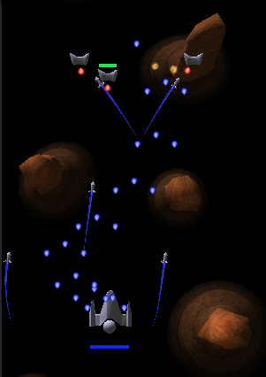

The other CSU subject I was undertaking this semester was Mobile Application Development. In this subject we were to present an idea and explain the platform it was targeting, why and an overview of how we were going to implement it.

The second was essentially a progress milestone showing off what you had accomplished in the short time, ~12 weeks but only about 8 hours a week. I managed to get a small shmup-upgrader made with Unity3D completed in this time, it is not at alpha yet but is mostly complete game loop, with all original assets created by me in Blender, Photoshop and Substance Designer.

These presentations are [available here](https://drive.google.com/folderview?id=0B3IiDGqoOqoSd3JHQ3NtUGs3V3c&usp=sharing)and the game (in its second Pre-Alpha release) is on the Google Play [here](https://play.google.com/store/apps/details?id=com.ahh.jsd_pa).