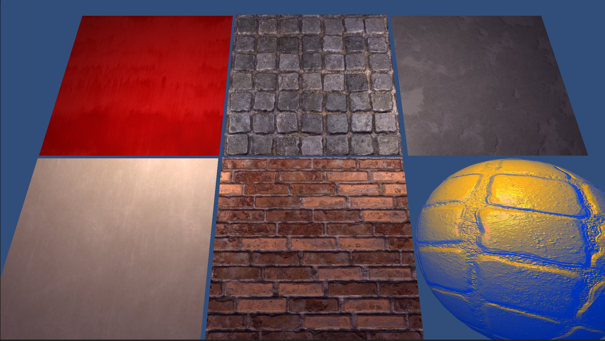
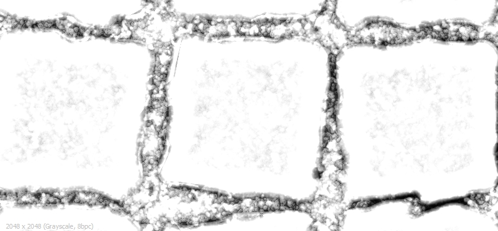
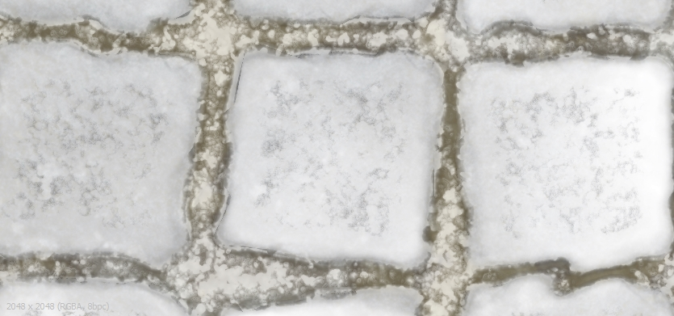
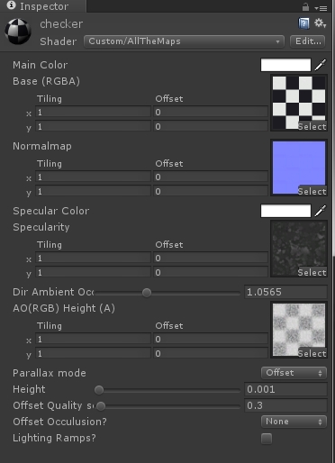
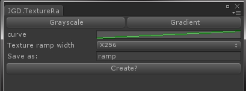
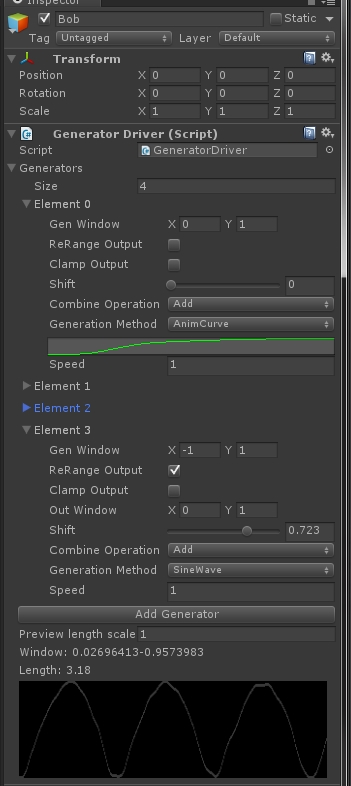
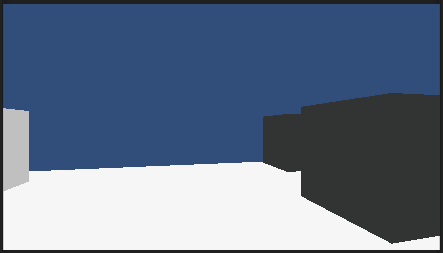
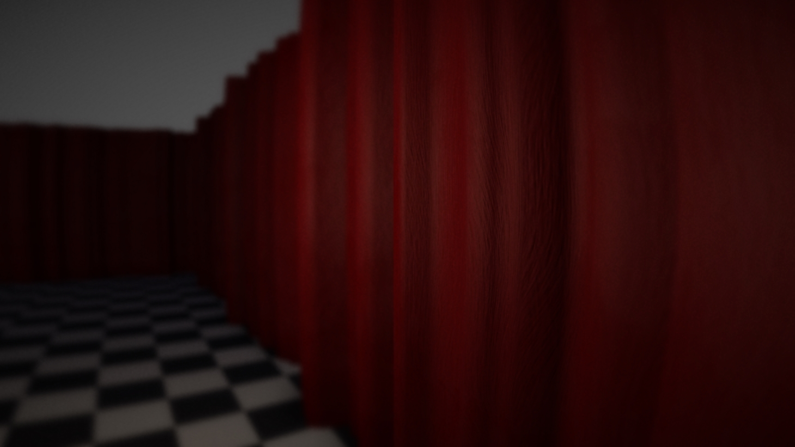
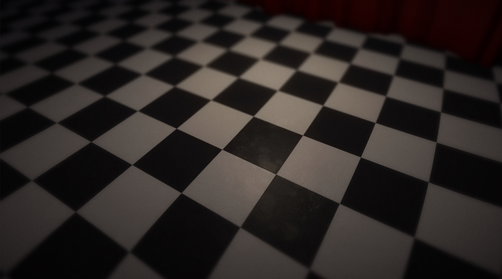

It&#8217;s been a busy few weeks. I&#8217;ve been knocked out a bit with a cold/flu thing and PAX. So there&#8217;s not as much to report as I would like but here&#8217;s the highlights.

PAX was great. Being in the bigger venue meant we could actually get to panels without waiting multiple hours in the cold and rain. Got to see lots of panels with indie devs and talk to them on the show floor. Numerous people told me GCAP is probably what I actually wanted to go to and their not wrong. It just wasn&#8217;t going to work out this year. Next year hopefully.

# Shaders

I&#8217;ve updated the shader in a bunch of ways. It&#8217;s more optimised, previously it was just using a separate texture for each map, now its all packed in channels. Considerably less total gpu ram usage and runs faster, few things that were previously floatx and how just single floats and things that used to be separate samples are now just swizzles. This simple sample scene is running comfortable at hunders of frames even on my mac air.

Grey AO

Coloured AO

I was talking to Tony at work about what I&#8217;d been messing with and he mentioned that it really bugged him that AO was always grey scale. So I have a first draft coloured AO in the shader and a node to generate it from diffuse, ao and height in Substance Designer. The early results are interesting, its kind of a very local faked GI or PRT. In any event I like the way it looks, it makes everything appear much richer instead of washed out.

Next up was a <a href="http://docs.unity3d.com/Manual/SL-CustomMaterialEditors.html" target="_blank">custom material inspector for the shader</a>, just so it can hide properties that aren&#8217;t being used, eg. here lightramp textures are not shown as they are not turned on, same with occlusion strength. Also I wanted to have both sliders and numbers showing for float ranges.

Also created a simple light ramp and gradient ramp texture creator (the yellow and blue ball above is using a dual colour ramp shader) so I didn&#8217;t have to keep going back n forth to photoshop etc. to create ramps. This is done by creating a <a href="http://docs.unity3d.com/Manual/editor-EditorWindows.html" target="_blank">custom editor window</a>.

&nbsp;

# Generators

I wanted to be able to chain together and merge different patterns and randoms etc. to generate dynamic anim curve style data. Specifically so I could not have to create custom animations for things like moving/flickering lights in the scene I&#8217;m working on. My first attempt worked great and code made sense and was a small and easy to maintain and extend. Unfortunately the way I was using inher didn&#8217;t play nice with unity inspector. So I redeveloped it as flat (and right now just a single class). The code is not as nice (it&#8217;s not soul code anymore) but it is entirely configurable from within the unity inspector.

This required both a <a href="http://unity3d.com/learn/tutorials/modules/intermediate/editor/building-custom-inspector" target="_blank">custom inspector</a> for GenerateDriver class and <a href="http://docs.unity3d.com/Manual/editor-PropertyDrawers.html" target="_blank">PropertyDrawer </a>for Generator class. I&#8217;m particularly fond if the real time preview. This head bob a few of these moving different local pos axis and lerping between idle and moving bob based on velocity, ~10 lines.

&nbsp;

Finally here is some very early stuff I&#8217;ve been working on for the Red Room. Mostly just upping my proficiency with Substance Designer.

&nbsp;