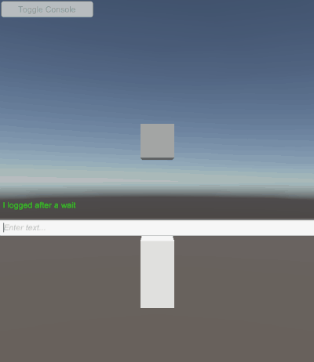
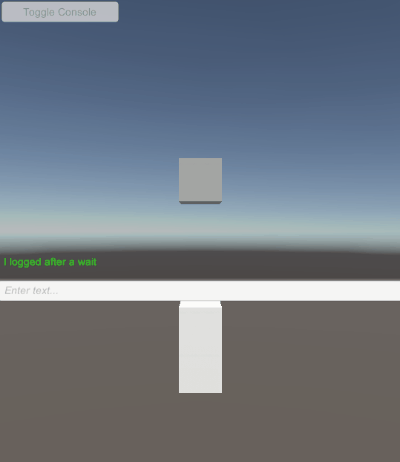
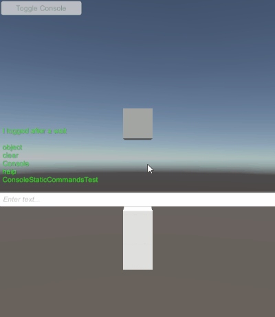

Previously [Part 3](http://stevehalliwell.com/dev-console-part-3/).

In the previous post I showed CUDLR from within Unity. This is done by some simple uGUI and a script that passes a line of text to CUDLR.Console.Run when the appropriate key is hit. I then added a callback to CUDLR to so I could get notifed when it wanted to log things so I could show them in my GUI elements. I didn&#8217;t want to just pipe these through Debug.Log as they are used for the console communicating with it&#8217;s user and are not things that need to show up in the Debug.Log peeking I have set up or in a file log if someone wanted to save all Debug.Logs out.

I also made a handful of small changes to CUDLR;

  * It stored items in its CommandTree via CommandAttributes directly, this irked me when it manually made one that wasn&#8217;t actually attached to anything. This means some data is duplicated now but nothing reports to be an attribute when it actually isn&#8217;t
  * used spaces as both the separator between child elements and parameters. I switched this to the more familiar &#8216;.&#8217; for child elements. 
      * This also meant that I refactored the few places it was previously relying on being able to regex or split on &#8216; &#8216; and made a dedicated function for extracting command location from parameters.
  * CommandTree had several recursive functions that did similar things for finding the desired command, then running it or auto completing name or adding a new command. I refactored that into a more general FindCommand function, this was easier and required because I also wanted to switch from spaces to &#8216;.&#8217; between child objects.
  * It&#8217;s function signature took string[]. Simplified that to string as I wanted my auto gen wrappers to do the conversion for me between a parameter string to object[].
  * Command entries in the tree didn&#8217;t know their name, only the parent object did. Added field to each entry so it knows what it is.
  * This allowed me to change how commands are stored to always be lower case and their own name storage to keep original cases. Which meant that I could easily make the auto completion case insensitive.
  * Made CUDLR.Console automatic registration of commands use the RegisterCommand path instead of slightly different method for them, means less things to test as now it is just a big loop that then uses the same thing everything else does.
  * Made RegisterCommand use the auto generated wrapper we built up in previous posts, this removed the need for CUDLR&#8217;s two delegates one with no params one with string[]

That&#8217;s great but lets talk autocomplete. The previous default behavior in the browser is you hit tab, and it uses the Complete method which returns an array of all partial matches. If there is only 1 partial match then replace the input box with that text. I wanted a bit more, if I type &#8216;ti&#8217; and the only partial match is &#8216;Time&#8217; then I run another auto complete on Time so it gives me a list of all the sub commands within the holder.

 

Similarly, if I type &#8216;phy&#8217; but I have &#8216;Physics&#8217; and &#8216;Physics2D&#8217;, I don&#8217;t want to have to type the &#8216;sics&#8217;. It should be smart enough to complete that part for me. I use something similar to this to determine it.

<pre class="lang:default decode:true ">public static int FirstCommonCharacters(string[] strs, int startingIndex = 0)
{
    var shortest = strs[0].Length;

    //find the actual shortest
    for (int i = 1; i &lt; strs.Length; i++)
    {
        if (strs[i].Length &lt; shortest)
            shortest = strs[i].Length;
    }

    //find where they stop matching
    for (; startingIndex &lt; shortest; startingIndex++)
    {
        var targetChar = strs[0][startingIndex];
        for (int i = 1; i &lt; strs.Length; i++)
        {
            if (targetChar != strs[i][startingIndex])
                return startingIndex;
        }
    }

    //never stopped matching so return what will be the shortest index
    return startingIndex;
}</pre>

I found some fun consequences of being able to automatically map objects and statics to the console, much of CUDLR.Console is static, so we can add the console to the console. Which means that we can run console commands via the console. Right now not overly useful, but I really enjoy that it just works and it may become useful if we push the console further towards a way of configuring and creating behaviours.

I was also able to get the console to add new types to itself at runtime. I enter this into the console.

<pre class="lang:default decode:true">Console.AddStaticTypeByString UnityEngine.Time,UnityEngine</pre>

Which ends up calling code that is something like this.

<pre class="lang:default decode:true ">[Command("Console.AddStaticTypeByString", "Attempt to add all static methods, props and fields of the type given by a string", false)]
public static void AddStaticTypeByString(string typeName)
{
    var t = System.Type.GetType(typeName, false, true);
    if(t == null)
    {
        Console.Log("Could not find type of name " + typeName + ". Make sure you are using the correct namespaces, nestedclass and assembly.");
        return;
    }

    AID.ConsoleHelper.AddAllStaticsToConsole(t);
}</pre>

This is crazy, we could now remotely connect to a running game via the browser, make it expose static data to us (as long as we know the full class name and the assembly it comes from). Without us even considering that we might have wanted to do that at build time. This also means that if ports are open you could play some amazing pranks on your colleagues. More practically it means you could have different sets of console commands exposed by default to different team members, eg artist wants lots of graphics and light settings exposed by don&#8217;t want to wade through physics or game balance data. But the moment they want access to other things they can add that to their console. It would might help in, &#8220;Um, can you come look at this weird thing&#8221; type situations, having another team member come over and add the elements to the console that they are used to and dig in to find out what is happening, they could also do this remotely, just post your IP in a slack channel.

In the future I&#8217;ll be looking into non-static things, most likely with a focus on data in [ScriptableObjects](https://docs.unity3d.com/ScriptReference/ScriptableObject.html).

[Part 5 here.](http://stevehalliwell.com/dev-console-part-5/)